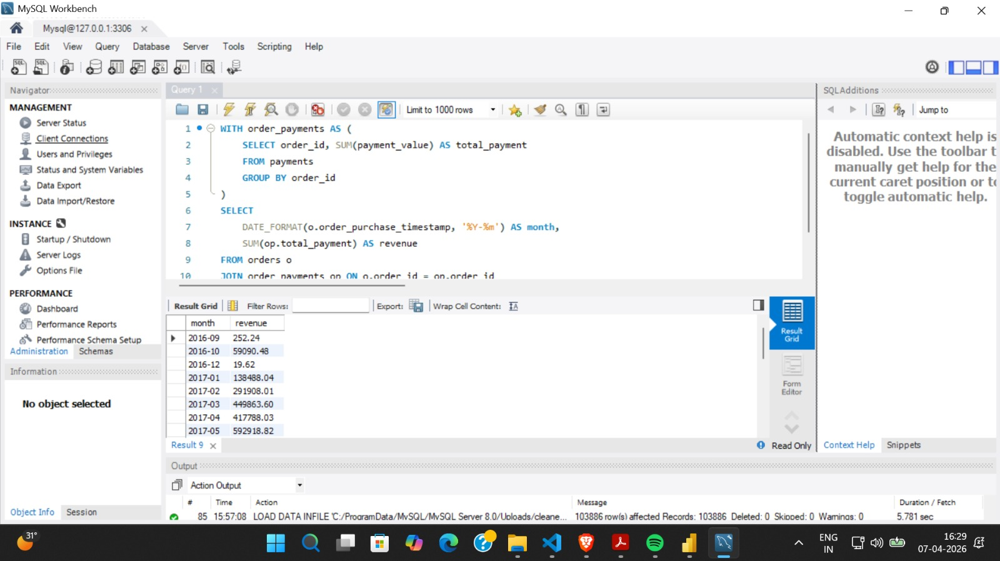

# Business Insights Engine (SQL)

## 📌 Objective
This project focuses on analyzing real-world e-commerce data to extract actionable business insights using SQL. The goal is to understand customer behavior, revenue trends, and operational performance through structured data analysis.

---

## 📊 Dataset
- Source: Brazilian E-Commerce Public Dataset (Olist)
- The dataset includes information on customers, orders, payments, and products.

### Tables Used:
- customers
- orders
- order_items
- payments
- products

---

## ⚙️ Project Workflow
1. Data extracted from real-world dataset (CSV files)
2. Data loaded into SQL database using structured schema
3. Multiple tables joined using primary and foreign keys
4. Analytical queries executed to generate business insights

---

## 🔑 Key Analysis & Insights

### 1. Revenue Trends
- Analyzed monthly revenue patterns using transaction data
- Identified growth trends and seasonal variations

### 2. Customer Analysis
- Identified top customers based on total spending
- Segmented customers into High, Medium, and Low value groups

### 3. Payment Insights
- Analyzed usage of different payment methods
- Evaluated contribution of each payment type to total revenue

### 4. Delivery Performance
- Identified delayed deliveries by comparing estimated vs actual delivery dates
- Highlighted operational inefficiencies in logistics

### 5. Customer Retention
- Identified repeat customers using order frequency analysis
- Evaluated customer loyalty patterns

---

## 🧠 SQL Concepts Used
- Joins (INNER JOIN)
- Aggregations (SUM, COUNT)
- GROUP BY & HAVING
- CASE statements (for segmentation)
- Window Functions (RANK)
- Date functions (trend analysis)

---

